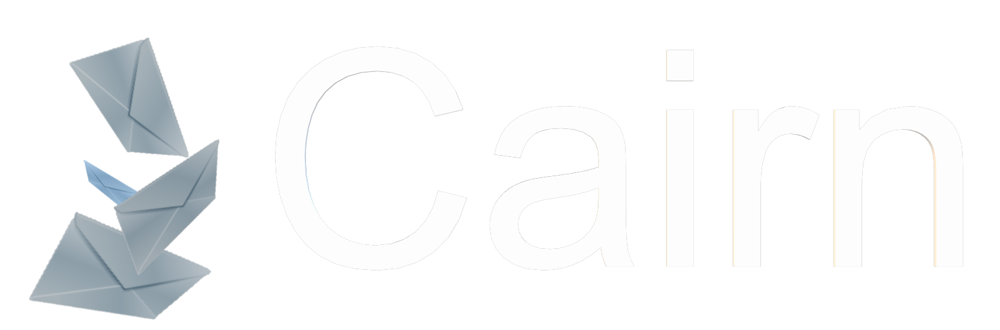

  

Cairn. Free anonymous chatmail server
---

## No login. No registration. No web interface.

You cannot log in here. You cannot sign up here. You cannot create an account on this website.  
There is no login page. There is no registration form. There is no username field. There is no password field.
This page is an informational page only.

---

## How to get an account

**The only way to create an account on Cairn is through Delta Chat.**
Delta Chat is a secure, open-source messaging app that uses email servers as its backend.  
It is available for Android, iOS, Windows, macOS, and Linux.
[**Create an account through Delta Chat →**](https://example.org/register)
*(This link is a placeholder. It will take you to a registration page on example.org.)*

---

## Instructions

**Step One: Install Delta Chat**  
Download Delta Chat from the official website or from your device's app store.

**Step Two: Open the registration page**  
Click the link above. The page will guide you through the process of connecting Delta Chat to the Cairn server.

**Step Three: Account creation**  
When you open Delta Chat and choose to create a new account with a chatmail server, you can select Cairn from the list of available servers. Delta Chat will automatically generate a unique username and password for you. This happens locally on your device. No personal information is sent to Cairn. No email address is required. No phone number is required. No verification is required.

---

## Encryption formats used by Cairn and Delta Chat

Cairn does not encrypt messages itself. Encryption is handled entirely by Delta Chat, the client application.  
Delta Chat uses several encryption formats to ensure your messages are secure.

### OpenPGP

OpenPGP (Open Pretty Good Privacy) is a widely used standard for encrypting and signing emails. It is based on a public key infrastructure, where each user has a public key and a private key.

- **Public key** — Shared with others to encrypt messages sent to you.

- **Private key** — Kept secret on your device to decrypt messages received.
  Delta Chat uses OpenPGP for end-to-end encryption of all messages by default. When you send a message to another Delta Chat user, the app automatically encrypts it with the recipient's public key. Only the recipient can decrypt it with their private key.
  [**OpenPGP on Wikipedia →**](https://en.wikipedia.org/wiki/Pretty_Good_Privacy#OpenPGP)
  
  ### Autocrypt
  
  Autocrypt is a specification for automatic OpenPGP key exchange in email. It eliminates the need for manual key management, making end-to-end encryption accessible to non-technical users.
  Delta Chat implements Autocrypt to automatically exchange public keys when you send a message to a new contact. No manual key import or export is required.
  [**Autocrypt on Wikipedia →**](https://en.wikipedia.org/wiki/Autocrypt)
  
  ### ChaCha20-Poly1305
  
  ChaCha20-Poly1305 is an authenticated encryption cipher that provides both confidentiality and integrity. It is designed to be fast and secure, especially on mobile devices with limited processing power.
  In Delta Chat, ChaCha20-Poly1305 is used as part of the encrypted message transport. It protects the content of messages after encryption and before transmission over the network.
  [**ChaCha20-Poly1305 on Wikipedia →**](https://en.wikipedia.org/wiki/ChaCha20-Poly1305)
  
  ### AES-256 (Advanced Encryption Standard)
  
  AES-256 is a symmetric encryption algorithm used in various security protocols. In Delta Chat, AES-256 is used in combination with other algorithms for key derivation and message encryption.
  [**AES-256 on Wikipedia →**](https://en.wikipedia.org/wiki/Advanced_Encryption_Standard)

---

## How encryption works in practice

When you send a message through Cairn using Delta Chat, the following steps occur:

1. **End-to-end encryption** — Delta Chat encrypts the message using OpenPGP with the recipient's public key.
2. **Authenticated encryption** — ChaCha20-Poly1305 provides additional integrity protection.
3. **Transport** — The encrypted message is sent over a TLS-encrypted connection to the Cairn server.
4. **Delivery** — The Cairn server stores the encrypted message until the recipient's Delta Chat client fetches it.
5. **Decryption** — The recipient's Delta Chat client decrypts the message using their private key.
   The Cairn server never sees plaintext messages. It only sees encrypted blobs of data.

---

## Why no web login?

Cairn has no web interface because a web interface requires a login system.
A web interface requires a database of usernames and passwords. A database of usernames and passwords can be compromised, logged, and used to track users. Cairn does not maintain such a database. Cairn does not log users. Cairn does not track users. Cairn does not know who you are.
The Cairn server is designed to work exclusively with Delta Chat clients. All account creation and authentication happens locally on your device.

---

## Security and privacy summary

- **No account database** — Cairn does not store a list of user accounts.
- **No login page** — There is no endpoint on the server that accepts username and password combinations.
- **No metadata logging** — Cairn does not log IP addresses, timestamps, or message metadata.
- **End-to-end encryption** — All messages are encrypted with OpenPGP and ChaCha20-Poly1305.
- **No personal data** — No name, no email, no phone number, no IP address, no device fingerprint.

---

## Mirrors

Cairn is a decentralized service. The community is encouraged to host mirrors of the Cairn server. All mirrors must follow the same encryption standards and pass a checksum verification.

### Mirror types

| Type       | Description                                                                                   |
| ---------- | --------------------------------------------------------------------------------------------- |
| **LAYER**  | A proxy layer between the user and the main Cairn server. Does not store messages.            |
| **HOSTED** | A fully independent Cairn server running on standard Cairn software. Stores messages locally. |

### Mirror list

| Mirror URL                      | Type   | Ping   | Status |
| ------------------------------- | ------ | ------ | ------ |
| `https://cairn.example.com`     | HOSTED | 45 ms  | 🟢     |
| `https://cairn.info.cern.ch`    | LAYER  | 120 ms | 🟢     |
| `https://mirrors.example.org`   | HOSTED | 210 ms | 🟡     |
| `https://cairn.example.net`     | LAYER  | 380 ms | 🔴     |
| `https://cairn.example.co.uk`   | HOSTED | 550 ms | 🔴     |
| `https://mirrors.cairn.example` | LAYER  | 30 ms  | 🟢     |

### Status legend

- 🟢 **Green** — Fast connection, optimal for your region.
- 🟡 **Yellow** — Average connection, may experience delays.
- 🔴 **Red** — Slow or unstable connection. Not recommended.

### How to verify a mirror

Each mirror publishes its SHA-256 checksum at `/.checksum`. You can verify that the mirror is running unmodified Cairn software by comparing the checksum with the official release.

Example verification command:

```bash
curl https://github.com/cairn-mail/checksum.sh | bash checksum.sh
```

## Frequently asked questions

**Can I log in to Cairn using a web browser?**
No. There is no web interface for Cairn. You cannot log in using a web browser.

**Can I create an account on Cairn using a web browser?**
No. There is no registration page. You cannot create an account using a web browser.

**How do I create an account on Cairn?**
You create an account by installing Delta Chat and selecting Cairn as your chatmail server. The link above will guide you through this process.

**What if I lose my account?**
You lose your account. There is no password recovery system. There is no account recovery system. There is no support team that can help you recover your account.

**Is Cairn really anonymous?**
Yes. Cairn does not ask for or store any personal information. There is no registration form, no email verification, and no phone number validation. You are anonymous by default.

**Is Cairn really free forever?**
Yes. There are no plans to introduce paid tiers or premium features. Cairn is maintained by volunteers and donations.

---

## Links

- [Create an account through Delta Chat](https://example.org/register)
- [Delta Chat official website](https://delta.chat)
- [Cairn documentation](https://example.org/docs)
- [OpenPGP on Wikipedia](https://en.wikipedia.org/wiki/Pretty_Good_Privacy#OpenPGP)
- [Autocrypt on Wikipedia](https://en.wikipedia.org/wiki/Autocrypt)
- [ChaCha20-Poly1305 on Wikipedia](https://en.wikipedia.org/wiki/ChaCha20-Poly1305)
- [AES-256 on Wikipedia](https://en.wikipedia.org/wiki/Advanced_Encryption_Standard)

---

*Cairn — Free anonymous chatmail server. No login. No registration. No web interface.*
